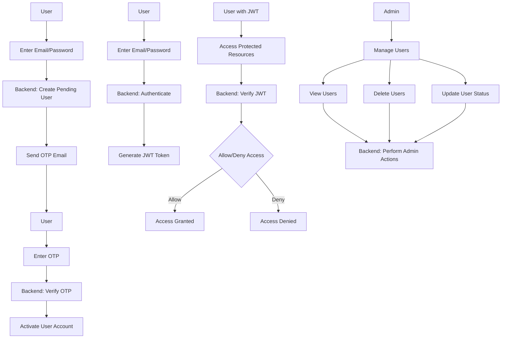

```mermaid
graph TD
    A[User] --> B[Enter Email/Password]
    B --> C[Backend: Create Pending User]
    C --> D[Send OTP Email]
    D --> E[User]
    E --> F[Enter OTP]
    F --> G[Backend: Verify OTP]
    G --> H[Activate User Account]
    
    I[User] --> J[Enter Email/Password]
    J --> K[Backend: Authenticate]
    K --> L[Generate JWT Token]
    
    M[User with JWT] --> N[Access Protected Resources]
    N --> O[Backend: Verify JWT]
    O --> P{Allow/Deny Access}
    P -->|Allow| Q[Access Granted]
    P -->|Deny| R[Access Denied]
    
    S[Admin] --> T[Manage Users]
    T --> U[View Users]
    T --> V[Delete Users]
    T --> W[Update User Status]
    U --> X[Backend: Perform Admin Actions]
    V --> X
    W --> X
```