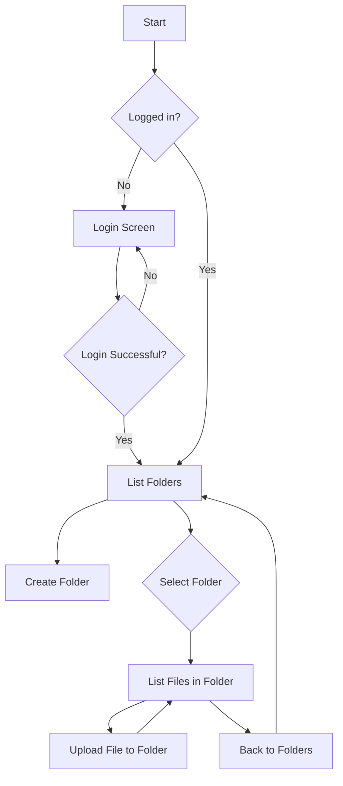

```mermaid
graph TD
    A[Start] --> B{Logged in?}
    B -->|No| C[Login Screen]
    C --> D{Login Successful?}
    D -->|Yes| E[List Folders]
    D -->|No| C
    B -->|Yes| E
    E --> F[Create Folder]
    E --> G{Select Folder}
    G --> H[List Files in Folder]
    H --> I[Upload File to Folder]
    I --> H
    H --> J[Back to Folders]
    J --> E
```